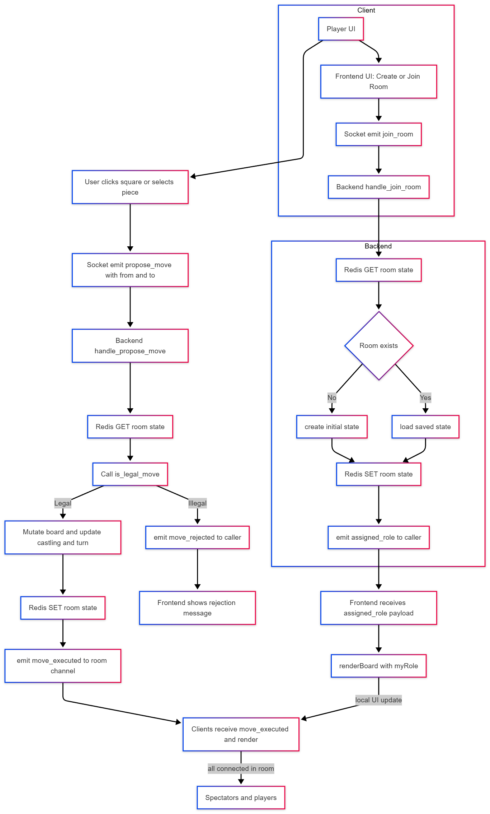

# Chess Multiplayer

A simple multiplayer chess project with a TypeScript frontend and a Python FastAPI backend using Redis for game state/coordination.

**Components**

- **frontend/**: A Vite + TypeScript single-page app that renders the chessboard, handles user input, and talks to the backend via Socket.IO. Development server and build tasks are defined in frontend/package.json.
- **backend/**: A FastAPI service (located under backend/src/backend) that contains the game referee, room management, and Redis integration. Uses `pyproject.toml` / `requirements.txt` for dependencies.
- **docs/**: Project notes and runbook.

**Live Demo**

A hosted live demo is available at: https://highfive52.github.io/chess-multiplayer/

**Architecture Diagram**



**Prerequisites**

- Node.js (16+) and `npm` for the frontend
- Python 3.12+ for the backend
- Redis server accessible at `localhost:6379` for local development (or a remote Redis URL)

You can run Redis locally or via Docker:

```bash
# Local (if installed)
redis-server

# Docker
docker run --rm -p 6379:6379 redis:7
```

**Run locally (frontend)**

1. Install frontend deps and start the dev server:

```bash
cd frontend
npm install
npm run dev
```

This serves the frontend (Vite). The frontend will attempt to connect to the backend at `http://localhost:8000` when the browser hostname is `localhost` (see `frontend/src/main.ts`).

Open the dev page reported by Vite (usually `http://localhost:5173`) in your browser.

**Run locally (backend)**

1. From the repo root, change into the backend folder and create/activate a virtual environment (PowerShell example):

```powershell
cd backend
python -m venv .venv
. .venv/Scripts/Activate.ps1
pip install -r requirements.txt
```

2. Start the FastAPI app with Uvicorn (example):

```bash
cd backend
# from inside the backend folder
uvicorn src.backend.main:app --reload --host 0.0.0.0 --port 8000
```

Ensure Redis is running before starting the backend.

**Run combined (root `npm run dev`)**

This repository includes a root-level helper that starts a Redis container, the backend server, and the frontend dev server in parallel using `concurrently`.


1. Prepare dependencies and start the combined dev runner:

```bash
# Install root dev dependency (concurrently) from repository root
npm install

# Ensure frontend dependencies are installed (required before running the root script)
cd frontend
npm install
cd ..

# Start everything from the repository root
npm run dev
```

The root `dev` script (in `package.json`) will:

- Start a Redis container using Docker: `docker run --rm --name chess-redis -p 6379:6379 redis:alpine`
- Launch the backend (via the `uv`/`uvicorn` runner): `uv run uvicorn backend.main:asgi_app --reload --port 8000`
- Launch the frontend dev server: `npm run dev --prefix frontend`

Notes:

- Docker must be installed and running locally for the root `npm run dev` script to start Redis.
- The root script uses the `concurrently` package (declared as a devDependency in `package.json`) to run these three processes together.

**Notes**

- The frontend stores a local `chess_user_id` token in `localStorage` and auto-joins a room if a `?room=ABCD` parameter is present in the URL.
- Lobby actions (`Create` / `Join`) update the browser search params and emit Socket.IO events to the backend.
- When running frontend and backend locally, make sure the backend is reachable at `http://localhost:8000` (the frontend falls back to a hosted URL otherwise).

**Troubleshooting**

- If the frontend doesn't connect, open browser console to confirm the backend URL and check CORS/socket settings on the backend.
- If the backend complains about Redis, verify the Redis server is running and reachable on `localhost:6379` (or set the appropriate env var in the backend if configured).

