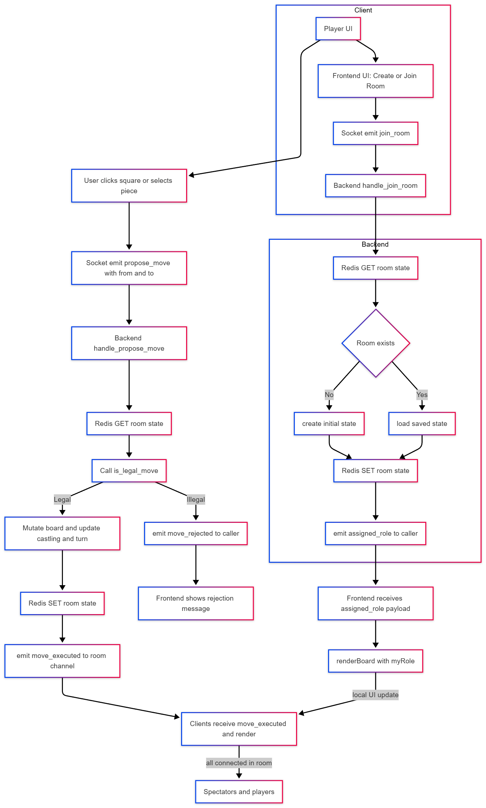

# Chess Multiplayer

A real-time multiplayer chess application with a Vite + TypeScript frontend and a Python FastAPI backend.

The application supports two-player games and spectators, with the backend acting as the authoritative source for game state and chess-rule validation. Socket.IO provides real-time communication between browsers and the backend, while Redis stores the shared live game state.

## Live Demo

The application is available at:

https://highfive52.github.io/chess-multiplayer/

## Architecture

```text
Browser
   │
   ▼
Vite + TypeScript Frontend
GitHub Pages
   │
   │ Socket.IO / HTTP
   ▼
FastAPI + Socket.IO Backend
Render
   │
   ▼
Redis-Compatible Key Value Store
Render
```

For local development, the same application architecture runs with the frontend and backend locally and Redis running in Docker.

```text
Browser
   │
   ▼
Vite Development Server
localhost:5173
   │
   │ Socket.IO / HTTP
   ▼
FastAPI + Socket.IO
localhost:8000
   │
   ▼
Redis
localhost:6379
```

### Game Flow



## Components

### `frontend/`

A Vite + TypeScript single-page application responsible for:

* rendering the chessboard using the DOM and CSS
* handling player interaction
* creating and joining game rooms
* submitting proposed moves
* receiving real-time game-state updates
* displaying games to players and spectators

Frontend dependencies and development commands are managed through `frontend/package.json` and `frontend/package-lock.json`.

### `backend/`

A Python FastAPI and Socket.IO service located under `backend/src/backend`.

The backend is responsible for:

* room creation and membership
* assigning white, black, and spectator roles
* maintaining authoritative game state
* validating proposed chess moves
* enforcing player turns
* detecting check, checkmate, and stalemate
* updating Redis
* broadcasting accepted game-state changes

Python dependencies and development tools are managed through:

```text
backend/pyproject.toml
backend/uv.lock
```

`backend/requirements.txt` is generated from the `uv` dependency definition for deployment environments that consume a requirements file.

### `docs/`

Contains project documentation, diagrams, implementation plans, and the development runbook.

## Technology

### Frontend

* TypeScript
* Vite
* Socket.IO Client
* ESLint
* Prettier

### Backend

* Python
* FastAPI
* python-socketio
* Redis
* Uvicorn
* pytest
* Ruff

### Development

* WSL / Linux
* `uv`
* npm
* Honcho
* Make
* Docker

## Prerequisites

The preferred local development environment is WSL/Linux.

Install:

* Python 3.12+
* `uv`
* Node.js and npm
* Docker
* Honcho
* Make
* pre-commit

Node.js should be installed directly in the Linux/WSL environment rather than using the Windows Node.js installation from inside WSL.

For example, Node can be managed with `nvm`.

## Initial Setup

Clone the repository and enter the project directory:

```bash
git clone https://github.com/highfive52/chess-multiplayer.git
cd chess-multiplayer
```

Install the backend dependencies:

```bash
cd backend
uv sync
cd ..
```

Install the frontend dependencies:

```bash
npm --prefix frontend ci
```

Or install both using the Makefile:

```bash
make install
```

Install the pre-commit hooks:

```bash
pre-commit install
```

## Run the Application

The preferred development command is:

```bash
make dev
```

This uses Honcho and `Procfile.dev` to start the local application processes:

```text
redis     → Docker Redis container
backend   → FastAPI + Socket.IO via Uvicorn
frontend  → Vite development server
```

The services are available at approximately:

```text
Frontend    http://localhost:5173
Backend     http://localhost:8000
FastAPI     http://localhost:8000/docs
Redis       localhost:6379
```

The exact frontend port is reported by Vite when it starts.

## Run Services Individually

The Makefile also exposes the individual services.

### Redis

```bash
make start-redis
```

This starts Redis using Docker.

### Backend

```bash
make start-backend
```

Equivalent to running:

```bash
cd backend
uv run uvicorn backend.main:asgi_app \
  --app-dir src \
  --reload \
  --host 0.0.0.0 \
  --port 8000
```

### Frontend

```bash
make start-frontend
```

Equivalent to:

```bash
npm --prefix frontend run dev
```

## Development Commands

Install all dependencies:

```bash
make install
```

Run the complete local environment:

```bash
make dev
```

Run backend tests:

```bash
make test
```

Backend commands can also be executed directly through `uv`:

```bash
cd backend

uv run pytest
uv run ruff check .
uv run ruff format .
```

Frontend commands are defined in `frontend/package.json`:

```bash
npm --prefix frontend run dev
npm --prefix frontend run build
npm --prefix frontend run lint
npm --prefix frontend run format
npm --prefix frontend run format:check
npm --prefix frontend run preview
```

## Code Quality

The project uses pre-commit hooks to run backend and frontend quality checks.

```bash
pre-commit run --all-files
```

The hooks run:

```text
Backend
├── Ruff lint
├── Ruff format
└── pytest

Frontend
├── Prettier format
└── ESLint
```

Ruff and Prettier automatically apply formatting changes. Linting and tests report issues that require developer attention.

The pre-commit configuration invokes the project's existing development environments rather than maintaining separate copies of the dependencies:

```text
pre-commit
├── uv
│   └── backend/pyproject.toml + uv.lock
│
└── npm
    └── frontend/package.json + package-lock.json
```

## Backend Dependency Management

`uv` is the authoritative dependency-management tool for the backend.

The primary files are:

```text
backend/pyproject.toml
backend/uv.lock
```

Synchronize the local environment with:

```bash
cd backend
uv sync
```

The deployment `requirements.txt` can be generated from the `uv` environment with:

```bash
cd backend
uv export \
  --format requirements-txt \
  --no-emit-project \
  --output-file requirements.txt
```

This keeps dependency ownership in `pyproject.toml` and `uv.lock` while still supporting deployment platforms that expect a `requirements.txt` file.

## Multiplayer Game Flow

When a player makes a move, the frontend sends the proposed source and destination coordinates to the backend.

```text
Player
  │
  │ select piece + destination
  ▼
Frontend
  │
  │ propose_move
  ▼
Socket.IO
  │
  ▼
FastAPI Backend
  │
  ├── identify player/session
  ├── load authoritative room state
  ├── determine piece at source square
  ├── validate move
  ├── validate turn
  ├── prevent self-check
  ├── update board
  ├── determine check/checkmate/stalemate
  └── persist current state to Redis
          │
          ▼
      move_executed
          │
          ▼
      Connected Players
      and Spectators
```

The browser proposes a move, but the backend determines whether that move is accepted. Clients do not directly mutate the authoritative game state.

## Game State

Redis stores the authoritative live state for each active room.

A room contains information such as:

* white player
* black player
* current turn
* board position
* castling rights
* game status
* winner
* check status

Socket.IO sessions maintain connection-specific information such as the current user and room.

This separates:

```text
Socket.IO session
    → connection context

Redis room state
    → shared authoritative game state
```

## Frontend Behavior

The frontend stores a local `chess_user_id` token in `localStorage`.

Room URLs use a query parameter such as:

```text
?room=ABCD
```

When a room parameter is present, the frontend can automatically join the corresponding game.

Lobby actions such as Create and Join update the browser URL and emit Socket.IO events to the backend.

During local development, the frontend connects to the backend at:

```text
http://localhost:8000
```

## Deployment

The production application currently uses separate frontend and backend hosting.

### Frontend

The Vite frontend is built and deployed to GitHub Pages using GitHub Actions.

### Backend

The FastAPI/Socket.IO backend runs on Render.

The backend starts with Uvicorn using the ASGI application:

```text
backend.main:asgi_app
```

### Redis

The deployed backend uses a Render Redis-compatible Key Value service.

The connection is configured through the `REDIS_URL` environment variable.

Local development defaults to:

```text
redis://localhost:6379
```

## Troubleshooting

### Frontend cannot connect to the backend

Confirm that the backend is running:

```bash
curl -I http://localhost:8000/docs
```

A successful response should return HTTP 200.

Also check the browser developer console for the Socket.IO backend URL and connection errors.

### Backend cannot connect to Redis

Confirm the Redis container is running:

```bash
docker ps
```

The local Redis service should be reachable at:

```text
localhost:6379
```

### Frontend dependencies behave differently between Windows and WSL

Do not reuse Windows-created `node_modules` from WSL.

Remove the existing frontend dependencies and reinstall them using the Linux Node/npm environment:

```bash
rm -rf frontend/node_modules
npm --prefix frontend ci
```

Verify that Node and npm resolve to Linux paths:

```bash
which node
which npm
```

When using `nvm`, they should normally resolve somewhere under:

```text
~/.nvm/
```

### Validate the development environment

Run:

```bash
pre-commit run --all-files
```

Then start the complete application:

```bash
make dev
```

Open two browser windows, create a room in one, join it from the other, and make a move to verify the full browser → Socket.IO → backend → Redis → browser flow.
